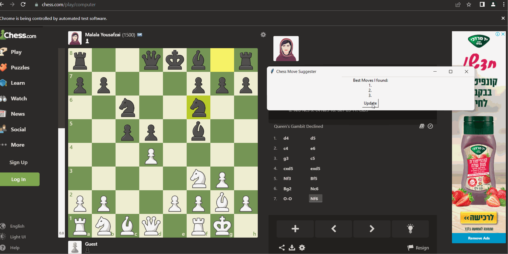

<h3> ChessHelper </h3>

<p> During my training for tournaments, I have discovered that the optimal approach to mastering openings is to identify the most effective moves for each variation. By utilizing chessHelper, it is possible to quickly access the top three moves without the need to navigate to the analytics page. </p>
<p> in this example I was playing the Queen's Gambit in the Idian game style </p>


<hr>

<h3> How to setup ? </h3>

<p> setup pythonic stuff</p>

```bash
    $ python -m venv env
    # connect to python virtual env:
    $ source env/Scripts/activate
    # install requirements
    $ pip install -r requirements
```

<hr>

<h3>How to run ?</h3>

```bash
    $ python main.py
```

start playing 🚀

<hr>

<u><b> feel free to open issues when you face any issue</b></u>
